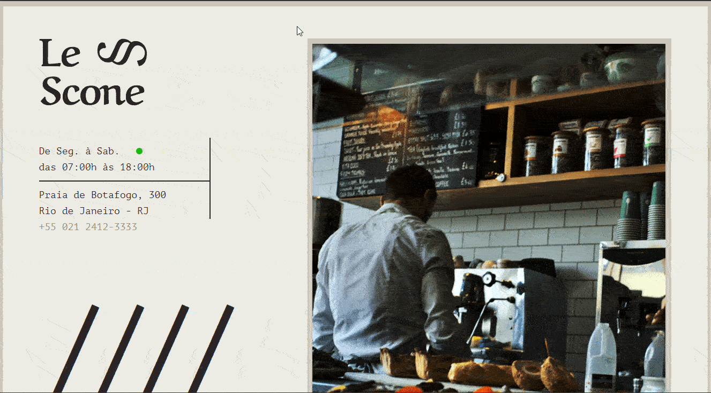

# Le Scone

Projeto do curso <a href="https://www.origamid.com/curso/css-com-sass/">CSS com SASS
</a> da <a href="https://www.origamid.com/">origamid.com</a>.

Projeto realizado com o intuito de praticar a produção de páginas na web, utilizando o SASS para organizar e otimizar a criação do código CSS.

Me siga no <a href="https://www.linkedin.com/in/jose-de-souza/">Linkedin</a>